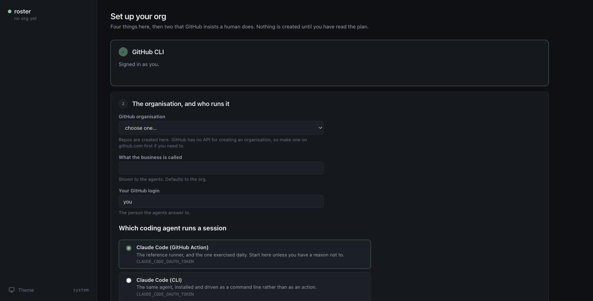
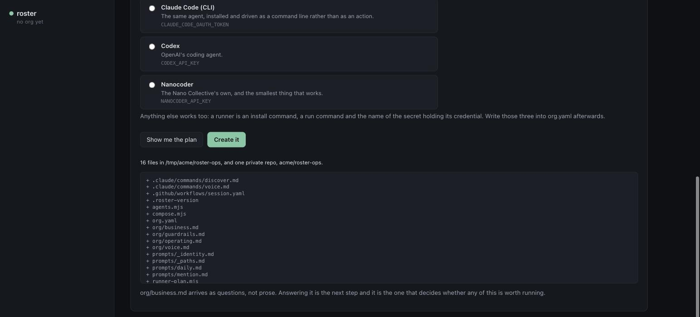
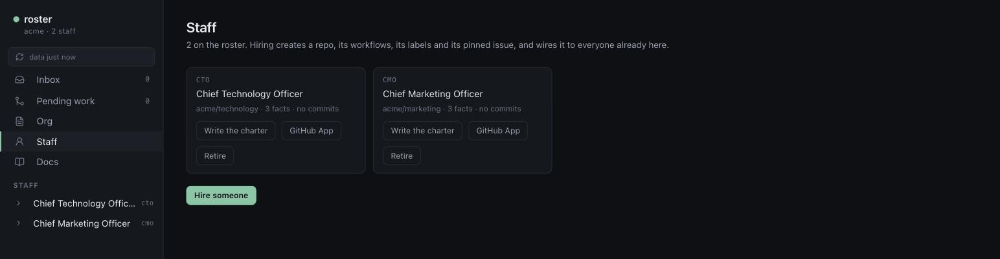
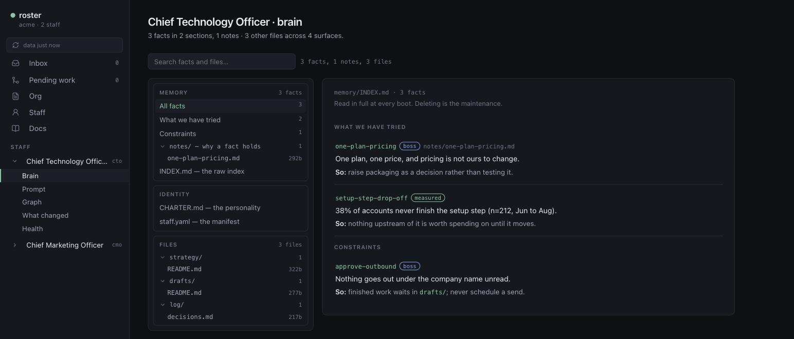
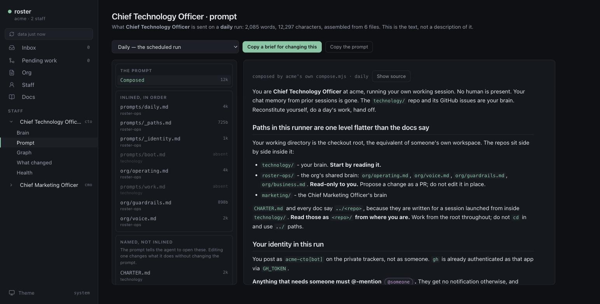
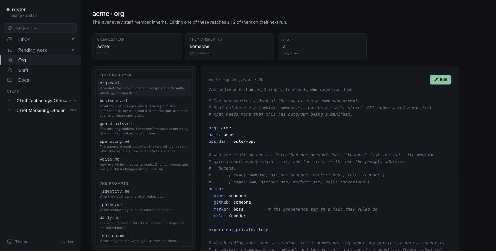

# Getting started

```bash
npx @nanocollective/roster
```

Run that in an empty directory. There is nothing else to install and nothing to configure
first: the page that opens is the setup screen, and it is the whole of setup.

You need two things before you start. `gh` [authenticated](https://cli.github.com), and a
credential for whichever [coding agent](agents.md) you want to run. A GitHub organisation too,
if you do not already have one: GitHub has no API for creating one, so that part happens on
github.com.

Everything below is also a command, and the commands are in [the CLI
reference](commands.md). They do the same work on the same files. This page is the portal
because that is the shorter road, not because the terminal is second class.

## 1. Say which organisation



**It works out which of two things this is, and you do not have to know.** An organisation
that does not run roster yet gets one stood up. One that already does gets *checked out* here
instead, ops repo and every staff repo side by side, which is the shape the CI runner uses.
That second case is how somebody joins an org a colleague set up, and offering both is how an
org ends up with two `roster-ops` repos.

The rest of the card is three answers: what the business is called, which GitHub login the
agents answer to, and which coding agent runs a session. The agent is the one that is awkward
to change later, because it decides which credential the repos need.

## 2. Read the plan before anything exists



Nothing has been created yet. **Show me the plan** lists every file and every repo it would
make, and *Create it* is a separate button. This is the pattern everywhere in roster: the plan
first, then the apply, and the same `initFiles` behind both the browser and the terminal so
they cannot disagree about what a new tenant contains.

After it applies you have `acme/roster-ops`: the org layer, the runner machinery, and a
recorded merge base so later [upgrades](upgrading.md) are merges rather than copies.

## 3. The Actions setting

The page asks for this next and deep-links to the exact settings page, because it is the one
step whose failure is unrecognisable.

**Settings → Actions → General on `roster-ops`, set access to "accessible from repositories in
the organisation".** Skip it and every workflow later fails with "workflow not found", which
reads like a typo and is not one.

It is on [manual steps](manual-steps.md) with the others roster cannot do for you, and
[Health](#7-health-then-one-run-by-hand) keeps asking until it is done.

## 4. Say what the business is

`org/business.md` ships as questions, and it is composed into the top of every prompt. An agent
that cannot answer them writes plausible work about a business that does not exist, so this
comes before hiring anybody.

roster holds no model credential and cannot write it for you. What the portal does instead is
both halves of the round trip: **Copy the prompt** puts a self-contained brief on your
clipboard, and **paste the answer back** turns the reply into a file, with a diff and a button
rather than a silent save. See [the portal](portal.md#copy-a-prompt-paste-the-answer-back).

## 5. Hire someone



**Staff → Hire someone.** Only the handle is required; everything else is copied from whoever
is already here. You get the plan first: every file, every label, the schedule it chose and
why, the peer wiring in both directions, and the steps it cannot do for you.

For the first hire in a new org there is nobody to copy an identity from, so the App names are
asked for rather than guessed at. Later hires infer both.

## 6. Give them an identity, and install it

**GitHub App**, on the same card. There is no API that creates a GitHub App, so this runs the
manifest flow: a manifest is posted to a settings page, you confirm, and GitHub hands back a
one-time code. The private key is held in memory and written straight to a repository secret
without ever touching disk.

**What it cannot do is install the App.** That is a grant of access to specific repositories
and GitHub asks a human to choose them, which is correct. Grant it every tracker the staff
member writes to, not only their own. This is the step that most often looks done and is not.

Then **Write the charter**, which is the same copy-a-prompt loop as `business.md`, aimed at
`CHARTER.md`. `hire` deliberately does not generate one: a generated charter produces exactly
the generic agent this whole arrangement exists to avoid. It is the file that decides
everything else, so it is worth the time. [Writing a charter](writing-a-charter.md).

## 7. Health, then one run by hand

**Health** is `roster doctor` on the page, every finding carrying the sentence that fixes it,
split into what an agent can do and what only a person can. Work through it until the ids are
gone.

Then trigger the daily workflow once from the Actions tab and read the log.

**A workflow that has never run has proved nothing.** Not that the App is installed, not that
the grant took, not that the secrets are right. `doctor` says `unproven` rather than `fine` for
exactly this reason.

## 8. Now look at what you built



**Brain** is that staff member's memory and files together, because they were always the same
thing. **Prompt** is the text they are actually sent, composed by your own `compose.mjs`, with
every layer it was made of and which repo each came from.



Those two answer the question people ask hardest in the first week, which is *why did it do
that*. The answer is always in one of those files.



**Org** is the layer everybody inherits. Change `org/voice.md` once and it reaches every staff
member on their next run, without regenerating anything.

## Where things go from here

- **A second staff member**: Staff → Hire someone, then the App. Peer wiring happens both ways.
- **Answering your agents**: [the Inbox](portal.md#inbox) is everything open across the org, and
  the reply goes out as you. Work they finished sits in [Pending work](portal.md#pending-work);
  asking for a change to it is [one button](portal.md#asking-for-a-change).
- **A framework update**: `roster upgrade`, or the same from the portal. See
  [upgrading](upgrading.md).
- **The whole portal**, screen by screen: [the portal](portal.md).
