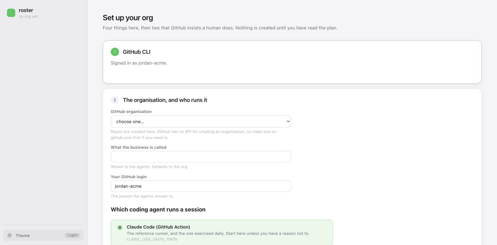
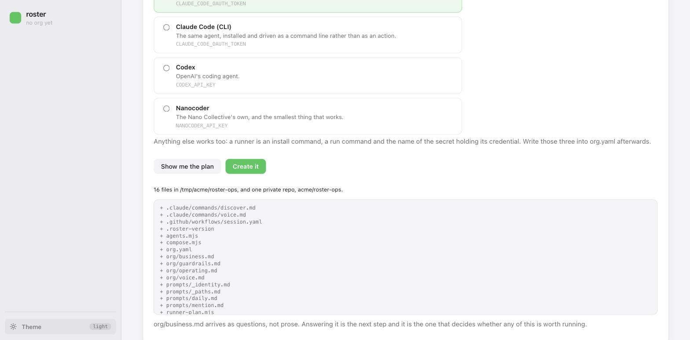
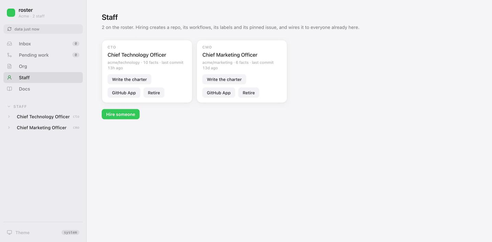
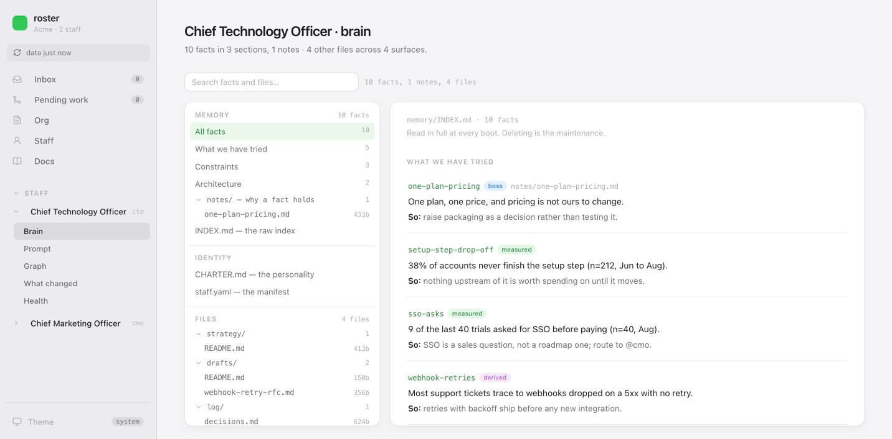
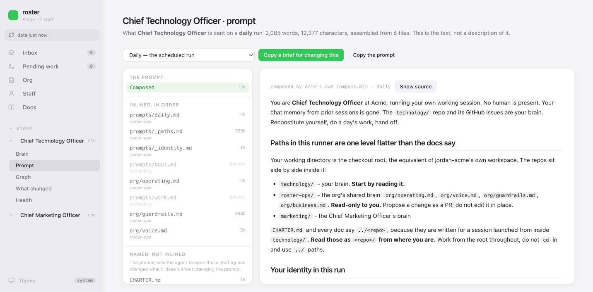
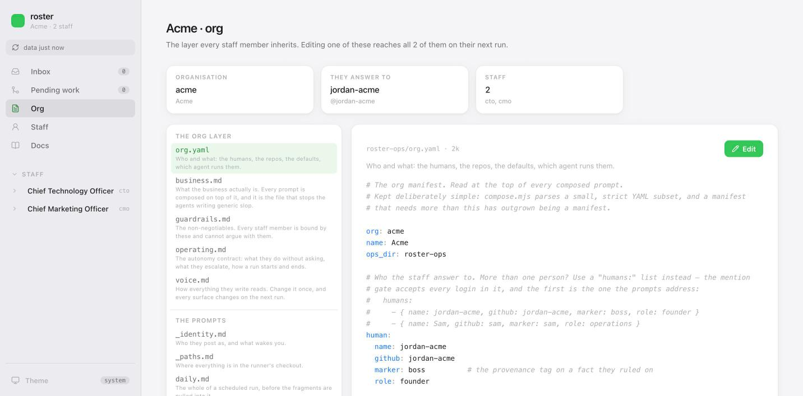

# Getting started

```bash
npx @nanocollective/roster
```

Run that in an empty directory. The page that opens is the setup screen, and it is the whole of
setup. Every step below is also a command, listed at the end; they do the same work on the same
files.

**How long it takes:** about an hour and a half to two hours to a first staff member's first
finished run. Most of that is writing: what the business is, and the staff member's charter,
each a conversation of twenty to thirty minutes with your own AI. The rest is about a dozen
clicks and waiting for the run. Those two files are what make the staff worth running, so that
hour is the part not to rush.

## Before you start

- **`gh`, [signed in](https://cli.github.com)**, as someone who owns the organisation. roster
  does everything through your own `gh` and holds no token of its own.
- **A GitHub organisation.** GitHub has no API for creating one, so if you need one, make it on
  github.com first. Brains are private repos; on GitHub Free that works, with one difference in
  step 5.
- **A credential for your [coding agent](agents.md).** For Claude Code, run
  `claude setup-token` and keep the token it prints for step 5.

You only need [the six things in Concepts](concepts.md#the-six-things-you-need-to-know) to follow
this. Everything else can wait.

## 1. Say which organisation, then read the plan



Pick the organisation, say what the business is called and which coding agent runs a session.
If the organisation already runs roster, the page offers to check it out here instead, which is
how a second person joins.



**Show me the plan** lists every file and repo it would make; *Create it* is a separate button.
That is the pattern everywhere in roster: the plan first, then the apply.

Creating it makes `<org>/roster-ops` and **sets its Actions access** so every repo in the org
can call its workflow. Without that every run fails with "workflow not found". If GitHub refuses
(it needs admin on the repo), the page says why and links to the setting to click instead.

The rest of the steps stay on the same page. Reload it and the portal opens on **Getting
started**, which keeps them in the sidebar until they are done, with hiring first.

## 2. Say what the business is

`org/business.md` ships as questions, and it is composed into the top of every prompt. An agent
that cannot answer them writes plausible work about a business that does not exist.

**Copy the prompt** puts a brief on your clipboard with every file it refers to inside it. Paste
it into Claude, ChatGPT or anything else; it interviews you and hands back the file. Paste the
reply into the box and you get a diff and a save button. See
[the portal](portal.md#copy-a-prompt-paste-the-answer-back).

Then `org/priorities.md`: what matters this month, ranked, and what is out of scope. A few
lines, only you can write it, so it opens in place on the setup screen and saves the same way.
See [concepts](concepts.md#priorities).

## 3. Hire someone



**Staff → Hire someone.** Only the handle is required. The plan shows the repo it creates, the
schedule it chose, and the commits it will make **as you** in repos that already exist: each
peer's `staff.yaml`, and `org.yaml`. Nothing is left uncommitted on disk.

For the first hire there is nobody to copy an App name from, so the form asks for two: this
staff member's App, and the shared public App. Names are unique across GitHub, so prefix them
with the org. The public one only matters if a product repo is public; leave it empty when they
are all private.

Product repos come from `org.yaml`. Mark one on the setup screen, or later with **Org → Add a
product repo**.

## 4. Create the App, and confirm the install

**GitHub App**, on the new card. GitHub has no API that creates an App, so a tab opens and you
confirm. The App's id and private key go straight into the repo's secrets and never touch disk.

Then **Install it**. The install page opens with the organisation and every repo this staff
member needs already ticked: its brain, the trackers of its peers, and the product repos. Check
the list and confirm. That confirmation is yours by design: installing grants access, and GitHub
asks a person.

## 5. Store the agent credential, once

**Agent credential**, on the card or on the setup screen. Paste the token from `claude
setup-token` (or your agent's key; the box says where to get one). It is stored as one
organisation secret, shared with the brain repos, and each later hire is added to it. It is not
asked for again.

On GitHub Free an org secret does not reach private repos, so there it goes on each brain repo
instead, and the page says so. It is still one paste now; a later hire needs it once more.

## 6. Write the charter

**Write the charter**, on the card. The same copy-a-prompt loop as step 2, aimed at
`CHARTER.md`, carrying the org layer, the peers' charters and, where the role matches one, a
[worked example](writing-a-charter.md#worked-examples) to model the shape on. The brief
interviews you; the charter is yours. roster never generates one, because a generated charter
makes exactly the generic agent this whole arrangement exists to avoid.

## 7. Run it once

**Run once now**, on the card or on **Health**. It starts the daily workflow, follows it, and
tells you how it ended, with the log.

**A workflow that has never run has proved nothing**: not that the App is installed on the right
repos, not that the secrets are right. Doctor reports it as `unproven` until one run has
finished, and this is that run. If it fails, the result names the step, and
[troubleshooting](troubleshooting.md) has what each failure usually means.

Health is `roster doctor` on the page. Every finding carries the sentence that fixes it.

## 8. Now look at what you built



**Brain** is that staff member's memory and files together. **Prompt** is the text they are
actually sent, with every layer it was made of and which repo each came from.



Those two answer the question people ask hardest in the first week, which is *why did it do
that*. The answer is always in one of those files.



**Org** is the layer everybody inherits. Change `org/voice.md` once and it reaches every staff
member on their next run.

## From a terminal

The same road, command by command. Each prints its plan and changes nothing without `--apply`.

`roster` below means `npx @nanocollective/roster@latest`, unless you have installed it with
`npm install -g @nanocollective/roster`.

```bash
roster init --org acme --apply        # the ops repo, and its Actions access
roster brief discover                 # a brief for org/business.md; write priorities.md too
roster hire cto --apply               # the brain, the wiring, the commits as you
roster app cto --apply                # the App, its secrets, and a pre-ticked install link
roster credential --apply             # the agent credential, once for the org
roster brief charter cto              # the charter brief, with the CTO example
roster run cto --apply                # one run, followed to the end
```

## What is still yours to do

Five things, each because GitHub or the job itself needs a person: creating the organisation,
confirming the App, confirming its install, getting the agent credential, and writing
`business.md`, `priorities.md` and each charter. [Manual steps](manual-steps.md) has why for
each.

## Where things go from here

- **A second staff member**: Staff → Hire someone, then GitHub App, the charter and one run. The
  credential is already there.
- **Answering your agents**: [the Inbox](portal.md#inbox) is everything open across the org, and
  the reply goes out as you. Work they finished sits in [Pending work](portal.md#pending-work).
- **A framework update**: `roster upgrade`, or the same from the portal. See
  [upgrading](upgrading.md).
- **The whole portal**, screen by screen: [the portal](portal.md).
