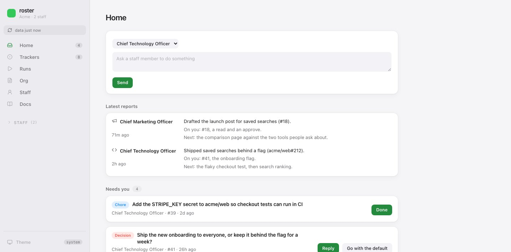

# The portal

```bash
roster                 # or `roster portal`, or `npx @nanocollective/roster`
```

A local web UI over the checked-out repositories. Reads them from disk, so it needs no
authentication and no API quota, and works offline. It can write to GitHub through your own
`gh`. See [hosting](hosting.md) for why it stays local.

Keep the repos checked out beside each other, in the same shape the runner uses.

## The sidebar

Anything that asks before it acts (a merge, a push, a hire, a retire, a paid run) asks in the
page's own dialog, never the browser's `confirm()`, which blocks the whole tab.

**The counts are right on load.** The badges beside Home and Trackers are fetched once at
boot, and the screens share that request rather than making a second one. A sidebar that
says nothing until you look at it is not a sidebar.

While the first answer is outstanding the badge is a placeholder rather than blank, because an
empty badge reads as zero and zero is a different claim from "still counting". The screens
themselves wait the same way: the inbox draws rows and the thread pane draws a page, in
placeholder shapes, for the seconds GitHub takes. Anything you start writing in that pane
survives the answer landing under it.

## Setup

**With no tenant where you started it, the portal is the setup screen instead.** That is not an
error state: it is the first thing anybody sees, and the page becomes the thing that fixes it.

The server starts without a workspace, borrows the framework's own `compose.mjs` until a tenant
has vendored its copy, and mounts only the setup routes. Everything else answers `409` with
`mode: setup` rather than dereferencing a workspace that was never found. The moment `org.yaml`
lands on disk it re-resolves, switches to the tenant's composer, and the rest of the portal
appears **without a restart**.

It asks GitHub which of two things this is:

- **The organisation already runs roster.** Then nothing needs creating; it needs checking out.
  The button becomes *Check it out here*, and it clones the ops repo and every brain side by
  side, which is the shape the CI runner uses. This is how a second person joins an org somebody
  else set up. *Create* is hidden, because offering both is how an org ends up with two ops repos.
- **It does not.** Then the plan is shown first, listing every file and the repo it would create, and
  nothing is written until you apply. Same `initFiles` the CLI runs, so the browser and the
  terminal cannot disagree about what a new tenant contains.

Then what is left. **The Actions setting**, read on arrival: if it is not set, *Set it for me*
asks GitHub to set it, and a refusal comes back with GitHub's reason and a link to the page to
click. **The agent credential**: a paste box, a line on where your agent's credential comes from,
and where it will be stored (one org secret shared with the brains, or each brain where an org
secret would not arrive, with the reason). The value goes to the local server in a POST and from
there to `gh` on standard input; it is never written to disk or echoed back. Until somebody is
hired the box says so, because nothing would read it. Then which repos the staff work in, as a
picker over what your `gh` can see minus what `org.yaml` already has, recorded with the
visibility GitHub reports. Then the two files only you can write: a prompt for writing
`org/business.md`, and `org/priorities.md` opened in place, stub and all, to replace with what
matters this month. Each says whether it is written yet.

Nothing here stores which step you are on. Setup takes days rather than minutes: an App has to be
installed, a credential set, a first run finished. So the page derives its state from `roster
doctor` every time it is drawn, and runs the check again after anything on it is saved. A stored
step counter would disagree with the world within an hour.

### Getting started

**Once the org exists, the same steps stay in the sidebar as *Getting started*** for as long as
anything is left: nobody hired, or `org/business.md` or `org/priorities.md` still the stub. An
org nobody has been hired into opens on it rather than on an empty Inbox, with *Hire your first
staff member* first, then the Actions setting, the credential, the repo picker, both files, and
what doctor still says. A link to another screen still wins. When the list is empty the entry
goes away; the repo picker lives on under [Org](#org).

## Home



Where the portal opens. An Ask box at the top, then these, in order.

- **Ask.** Pick a staff member, type what you want, **Send**. It opens an issue on their
  tracker with their `@handle` in front, which wakes them in about a minute.
- **Latest reports.** Each staff member's run report from the last day: the three lines they
  post on their status issue at the end of a daily run, with the issues and pull requests it
  names as links. Click a report to open their status issue. Nothing shows until there is one.
- **Needs you.** Every ask a staff member has put on you, and every pull request ready to
  merge, oldest first. Each card has one action on its right:
  - a `decision` has **Reply**, and **Go with the default** when it carries one. The default
    and its date are shown, and turn amber once the date has passed.
  - a `review` has **Approve**.
  - a `chore` has **Done**, which closes it.
  - a pull request has **Merge**, unless its checks fail, are still running, or it conflicts.

  Answers go out as you, with the staff member's `@handle`, so they act on them straight away.
  Once you have had the last word, the card leaves Needs you for Your requests, since it is
  waiting on them now. If they reply, it comes back. When nothing is waiting, it says so.
- **Unread.** Anything on a staff member's own tracker, or elsewhere, with activity you have not
  seen: a peer's ask, a status issue, their own work. Unread comes from your GitHub
  notifications, as on Trackers. Cards and rows anywhere on Home carry the same blue mark, and
  opening one marks it read here and on GitHub.
- **Working now.** Each staff member: what they are running and what started it (the daily run,
  a follow-on, answering an issue, a peer's ask), for how long, with a link to the log. When
  they are idle, how their last run ended. Peer and follow-on runs today are counted against
  `max_runs_per_day`. This asks GitHub every few seconds while a run is going and every half
  minute otherwise, and only while Home is on screen.
- **Your requests.** What you asked for, and asks of theirs you have answered: waiting, being worked on (a run for it is going), or
  answered (a staff member had the last word).
- **Closed today.** What the staff closed today, with the line they closed it with, and
  **Reopen** beside each. Staff close finished issues themselves, so this is where you check.

**Every item opens in a side sheet.** Click anywhere on a card or a row and its thread opens
on the right: the conversation, Reply, Close or Reopen, Merge for a pull request, and Open in
GitHub. Escape or the × closes it, and Home repaints where you were.

**Nothing is missed.** Every open issue and pull request has exactly one place: on Home, or on
the staff member's own tracker (their status issue, a peer's ask, their own work), or elsewhere
(draft pull requests, contributor issues). The line at the bottom counts the last two, with a
link to Trackers.

## Trackers

Everything open across the org, from one GraphQL call per repo. Bodies and full timelines come
down with the list, so opening a thread is a render rather than a request.

- **The links under Trackers in the sidebar filter it.** All; Unread; each staff member, which
  lists the issues on their own tracker whoever filed them; and Issues, the product repos.
- **Unread comes from your GitHub notifications.** A thread with activity you have not read has
  a bar on the left and a bold title, and Unread lists only those, with a count. Opening one
  marks it read on GitHub too, and reading it on GitHub clears it here. GitHub only notifies you
  about repos you watch and threads you are part of.
- **Open or closed.** Open by default: an inbox is what is waiting on
  somebody, and months of finished work mixed into that answers a different question. Closed
  work reaches back 45 days, up to 30 issues and 30 pull requests per repository, and carries
  a shorter timeline than open work because it is there to be read rather than triaged. A
  closed row is dimmed and marked; the sidebar badge keeps counting only what is open.
- **Reply, close, reopen, open an issue.** All as you, through your own `gh`, so they are
  indistinguishable from doing it on the site. Closing asks for confirmation. A half-written
  reply survives a repaint, and pressing Comment with an empty box says so rather than
  silently doing nothing.
- **A new issue asks one question: who is it for.** One dropdown, over the staff. It goes to
  that person's brain repo and their `@handle` is written into the body for you, because those
  are the two things that make an issue reach an agent rather than sit there. Asking for a
  repo as well would let you pick a pair that wakes nobody. To file in a product repo instead, use GitHub: this form is for asking the staff for
  something.
- **Labels are the repo's own, as toggles.** They are the labels that exist on the recipient's
  repository, fetched from GitHub and cached. A text box was a spelling test: `from-cmo` and
  `from-CMO` are different labels and only one of them exists.
- **Typing `@` offers the org.** A mention is the mechanism, not decoration: a staff member's
  workflow gates on their handle, so a misspelled one is a message nobody is woken by. The list
  is the staff and the humans, and nothing else. The Apps are deliberately absent: `@acme-cto`
  is a login rather than an inbox, GitHub delivers nothing for mentioning one, and an agent
  wakes on its own handle and not on the identity it posts as, so offering them is offering
  entries that do nothing. Each row says which it is, the list appears under the caret, arrow
  keys and Enter pick, Escape dismisses the list rather than the dialog around it, and an email
  address is not a mention.
- **Attachments.** Drop a file on the box, pick one, or paste one. Paste is the one that
  matters, because a screenshot is on the clipboard and never on disk. GitHub's own drag-and-drop
  attachments are minted by its web app and cannot be made with `gh`, so the file is committed
  to `attachments/<date>-<name>` in the repo the issue lives in and pushed. The body gets the
  link for you and the repo-relative path for the agent, which reads it off its own checkout
  rather than needing a token for a private repo. 25MB a file; a failed push is reported rather
  than hidden.
- **Reactions.** The 👀 an agent leaves when it picks something up, under the comment it is on,
  with who left it. Without it you post a comment, see nothing change, and have to open GitHub
  to find out it landed.
- **How much conversation** is on each row, which is most of what tells a live thread from
  something filed and never answered.
- Issue and PR references in a body become chips you can click through, and `@handle`
  mentions become chips too. A mention of somebody on this roster goes to their repository
  rather than to a GitHub profile of that name, which for `@cto` is a stranger.
- **Not every comment is markdown.** Deploy bots post raw HTML. A `<table>` renders as a
  table, and inline `<a>`, ``, `<strong>`, `<em>`, `<code>` and `<br>` are reduced to
  what they stand for. Nothing relaxes the escaping: the HTML is taken apart and its pieces go
  back through the same escape-first renderer as everything else, so no markup from a comment
  ever reaches the page. Code spans and fences are left alone, so a comment discussing
  `<meta name="robots">` still says so, and a tag outside the handful above stays visible as
  text rather than being silently deleted.
- **The whole thread, not just the comments.** Cross-references ("mentioned this in #55"),
  commits that reference the issue, and close, reopen and merge events sit inline in GitHub's
  own order. Labels, assignees and renames are bookkeeping, so a run of them folds behind one
  disclosure. An item a cross-reference points at opens in the portal when the inbox already
  holds it, and on GitHub when it does not.

## Pending work

The same screen, scoped to pull requests. It is where a pull request opens from Home. An inbox is what is
waiting on you; a pull request is work that is finished and waiting on a merge, and the count
that matters is not how many are open but how many are green and still sitting there.

It is called **Pending work** rather than "Pull requests" because that is what is behind it: a
piece of work a staff member finished and cannot land alone. A pull request is how it arrives,
not what it is.

A pull request's thread has three tabs.

- **Conversation** is the thread: body, timeline, reactions, reply box, same as an issue.
- **Commits**, with subject, author and sha, each linking to GitHub.
- **Files**: the full patch, rendered as a diff with line numbers, the same renderer *What
  changed* uses. A file with no patch is binary or too large for the API to send one, and says
  so rather than showing nothing.

Both are fetched when you open the tab, not carried by the inbox. A diff is the biggest thing
on this screen by an order of magnitude, and paying for every open PR's diff on every refresh
of every repo to show one of them is the wrong trade.

**Merge** sits beside Close and asks before it goes. It never deletes the branch: that is a
second decision and not this button's to make. It runs `gh pr merge` as you, so a protected
branch, a failing required check or a merge queue behaves exactly as it would on the site.

**It does not ask how.** Squash, merge commit or rebase is a question about git rather than about the pull request in front of you, the repository
has already answered it in its own settings, and on any given repository most of the answers are
wrong. So the repository is asked instead: squash where it is allowed, then a merge commit, then
rebase.

### Asking for a change

**`@cto` on a pull request wakes nobody.** A staff member's caller workflow lives in their own
brain repo and gates on their handle appearing *there*; on a product repo the same mention
posts, renders as a chip, and does nothing. That is deliberate, for the reasons in
[security](security.md#trust-in-a-prompt). Saying so out loud is the portal's job, because a
silent no-op is worse than the restriction itself.

**Reply is the one box, and it handles this.** Name somebody in a reply where a comment will
not reach them and the offer appears under the box, ticked: *open it on their tracker too*. One
press of Comment posts your words on the thread and opens the request on their tracker, which
carries

- the pull request, its link and its branch
- their `@handle`, which is what actually wakes them
- an instruction to **answer on the pull request**, because `prompts/mention.md` otherwise tells
  them to answer where the request came from, which here is the tracker, leaving the diff silent
  and you watching the wrong page
- the diff for the file you asked from, if you started from one, clipped: it is there to say
  *which part*, not to be a copy of the diff that goes stale on the next push

Untick it and the reply is just a comment. Who gets asked comes off the text you actually sent,
so a handle you typed and then deleted is not asked.

On the **Files** tab each file's heading has its own Reply, which opens the same box about that
one file. "This bit is wrong" is what you want to say while looking at a diff, and the
alternative is describing in prose which of thirty files you meant.

Both writes go through your own `gh`, as you. Nothing is dispatched between repositories and no
credential is put on a public repo. The tracker issue goes first, because it is the half that
reaches anybody; if the copy on the pull request then fails you are told, rather than being
shown an error that invites you to ask the same person the same thing twice.

## Runs

What each staff member ran in the last 30 days: when, daily or mention, how it ended, how long
it took, turns and cost where known, and a link to the log. Above the tables, the 30-day total
for the org, and each staff member's own in their heading.

Runs are not in any repo, so this is the one screen that is only ever on GitHub. It reads the
run lists through your own `gh`, the same way the inbox does, and offline it says so rather
than drawing an empty table that reads as "nothing ran".

Cost comes from the record each run leaves behind (see [cost](cost.md#what-each-run-cost)). A
run from before records existed, or from an agent that does not report cost, shows a dash, and
a total says how many runs it could price. Each record is downloaded once, ever, and kept in
`~/.cache/roster/runs` (or `ROSTER_CACHE_DIR`), since a finished run's record never changes.
The table shows at once with the costs already known; any not yet read are fetched in the
background, and the screen says how many and fills them in as they arrive.

The run list asks GitHub for each outcome separately (succeeded, failed, cancelled and so on)
rather than paging through every run, because most of a mention caller's runs are comments that
woke nobody and were skipped.

A skipped mention is not a run and is not listed. A `setup-failure` is a run that failed before
the agent started, usually a token or a checkout. Past a [`budget`](org-yaml.md#budget), the
total turns amber.

## Org

The layer every staff member inherits, in one place: `org.yaml`, every `org/*.md`, and the
prompt files in `prompts/`, each with a line saying what it is for, because a filename tells
you nothing about which to open. Anything roster does not ship falls back to its own first
heading.

**Add a product repo** opens the same picker setup uses, so a repo created later does not mean
typing `role: product` into `org.yaml` by hand. Adding one commits `org.yaml` and pushes. A new
hire picks it up; somebody already hired keeps the `works_in` in their own `staff.yaml`.

**The list comes off disk**, not out of the page, so a tenant that adds `org/pricing.md` can
open it like any other. Only files the
portal may actually write are listed: an editor that offers a file it cannot save is a trap.

Every one of them is editable from the screen it is read on: an **Edit** button on the file,
⌘S to save, and saving commits and pushes. Only `org.yaml` asks for confirmation first; a
prose edit is one commit to revert, and asking every time teaches people to click through the
question.

`org.yaml` is the exception to the write allowlist. It belongs to the person rather than the
agent, so it is writable. But it is the one file here that stops every prompt composing when
it is wrong, so the server parses it with the tenant's own `compose.mjs` first and refuses
anything that is not YAML it can read, or that has lost `org`, `name`, a handle on a staff
entry, or a github login on an entry in [`humans`](org-yaml.md#human-and-humans).

YAML is coloured, here and anywhere else the portal shows it: comments, keys, strings, numbers
and the three keywords. `org.yaml` and `staff.yaml` are the two files anybody reads closely,
and finding a key in a flat grey wall means reading every line.

The card at the top names **everyone** the staff answer to, not the first of them. An org can
have more than one human, and a card that names one of two reads as the only one who counts.

## Staff

Everyone on the roster, and the things you would otherwise do from a terminal.

**Hiring** starts from a role. With nobody hired the Staff screen opens on the role picker;
after that it is behind **Hire someone**. The cards are CTO, CMO and Support, each with a line
on what they do, and **Something else**, which asks for the role's name and a sentence about it.
A role that is already hired is not offered. Picking one fills in the handle, name and repo
(`cto`, `cmo`, `support`, or a handle made from the name) and leaves the schedule empty, so the
server picks a free slot. All four are under **Advanced**, still editable. The first hire has
nobody to copy App names from, so Advanced also holds the App's name and the shared public
App's, which are `--app` and `--public-app`, filled in as `<org>-<handle>` and `<org>-robot`.
The public one only matters when a product repo is public; on private ones the session uses the
staff member's own App.

The role opens a numbered list on the same screen:

1. **Hire.** One sentence from the plan: the repo it creates and when it runs. **Show details**
   has the full plan, from the same `buildPlan` and `applyPlan` that `roster hire` runs on the
   server: every file, every label, the schedule and why, the commits it makes as you in repos
   that already exist (each peer's `staff.yaml`, `org.yaml`), and whether the new brain joins
   the credential's org secret. **Hire** asks before it acts.
2. **Create their GitHub App.** The private App, and the shared public one only when a product
   repo in `org.yaml` is public (or has no visibility written, which hire treats as public).
3. **Write their charter.** Three tabs: an AI interview (the default), the matching worked
   example with your business's name in place of Acme's, and the file itself. A role that
   matches no example has no template tab.
4. **Add your agent credential.** Only while none is stored.
5. **Run once now.**

Steps 2 to 5 say *Hire first* until the hire is done. Each step's Done comes from real data:
the hire from the staff member appearing in `org.yaml`, the charter from `CHARTER.md` no longer
being the stub (the same test as doctor's `charter.stub`), the App from its `_APP_ID` secret on
the brain repo, the credential from the org secret, and the run from a successful daily run.
After **Hire** the screen reloads the org and stays on the same staff member, on step 2.

A card whose setup is not finished (a stub charter, no App secrets, or no successful run yet)
shows **Finish setting up**, which opens the same list for them. The App secrets and the run
are read from GitHub, so offline only the charter counts.

**Writing the charter** is the copy-a-prompt loop below, aimed at `CHARTER.md`. `hire`
deliberately does not write it, because a generated charter produces exactly the generic agent
this whole arrangement exists to avoid. It is the same brief as `roster brief charter
<handle>`, with somewhere to put the answer, and a picker for the worked example it carries as a
model: matched to the role, or another, or none. For a role added with **Something else**, the
sentence you typed goes into the brief.

**The GitHub App** is `roster app`, on this server rather than a second one. There is no API that
creates an App: the only route is the manifest flow, where you post a manifest to a settings page,
a human confirms, and GitHub hands back a one-time code. `roster app` stands up its own listener on
4310 to catch that; in the portal it runs on the port you are already on, so it is one browser and
one origin. The private key is still held in memory and written straight to a repo secret.

GitHub redirects the tab *it* opened, not the one you clicked from, so the original polls for the
result. What it cannot do is install the App: that is a grant of access to specific repositories
and GitHub asks a person to confirm it, which is correct and should not be worked around. So the
panel's **Install it** opens the install page with the org and the repos already selected: the
brain, every peer tracker it writes to, and the product repos. Any whose id could not be read are
listed for you to tick.

**Agent credential** is the setup screen's paste box, reachable from each card, because the
moment you look for it is while setting somebody up. It is once for the org.

**Run once now** starts the daily workflow, follows it, and shows how it ended with the log's
link and, on a failure, the step it failed at. It asks first, because it is a real run. A success
is what turns doctor's *unproven* into proven. Health has the same button.

**Retiring** is `roster retire`, and it is deliberately not deletion. A brain repo is that
agent's entire memory and there is no undo, so retiring disables the workflows, unwires them
from `org.yaml` and from every peer, and deletes the dead `from-<handle>` labels. The plan says
what it keeps as prominently as what it stops, because that is the thing you have to believe
before clicking it.

## Brain

Memory and the file tree, merged, because they were always the same thing: both manifests
already declared `memory/` as a surface.

The navigator has three boxes, because a parsed memory section and a file on disk are
different kinds of thing.

**What they know** is the fact sections, the notes behind them, and `INDEX.md` itself. A note is the
argument behind one fact, read only when that fact is in play, which is what keeps the index
cheap enough to read at every boot. Both live here rather than among the files: `INDEX.md` is
literally what "All facts" renders.

**Identity** is `CHARTER.md` and `staff.yaml`. Neither is in a declared surface, and they are
the two files that decide what this staff member is.

**Files** is every other declared surface, folded, with anything over a dozen files closed.

One search box searches facts and files together: type a slug and the matching facts are
offered directly. Clicking a fact's name narrows the pane to its section with that fact lit;
a crumb says so, and Escape or either crumb widens it again.

Renderers follow the surface's `render` field: markdown as documents, images, CSV as tables,
code with its line breaks. A relative link inside a brain document opens that file in the pane
rather than going nowhere.

## Prompt

**What this staff member is actually sent**, the same as `roster prompt <handle> --kind daily`.
Composed on the server by the tenant's own
`compose.mjs`, so there is no second implementation to drift.

Pick the kind: `daily` or `mention`. A mention prompt is written for the comment
that woke it, so a preview fills in obviously-fake context.

Beneath the composed text, the files it was made of, in two groups.

**Inlined, in order** is walked out of the `{{> …}}` includes rather than written down, so it
stays true when somebody adds a fragment. Each row says which repo it came from, because a
change to `roster-ops/org/voice.md` reaches every staff member and a change to a brain's own
`prompts/work.md` reaches one. An optional fragment (`{{>? …}}`) that a role does not have is
shown as absent rather than hidden.

**Named, not inlined** is `CHARTER.md`, `memory/INDEX.md` and `org/business.md`. The prompt
tells the agent to open these; it does not contain them. Editing a charter changes what an
agent does without changing a byte of the composed prompt, and that distinction is easy to
miss.

What is *wrong* with any of this is on [Health](#health). This screen answers "what is sent";
whether what is sent is any good is a different question, and a tree that was half prompt and
half complaints answered neither well.

### Getting help changing it

**Change this with your AI** opens a side sheet in three steps:
1. What you want changed, in a box big enough to say it in.
2. **Copy the prompt**: a self-contained brief carrying the composed text, every layer with its
   path and blast radius, and what may and may not be edited. It only copies. The prompt as it
   composes today is under it, to read first.
3. Paste your AI's reply. It hands back whole files, which are checked against the layers this
   prompt is made of and shown as diffs, each with Save. Nothing is written until you press it.

`roster brief amend <handle> --want "…"` prints the same brief from the terminal.

It carries the state rather than asking for it, because working out which of eight files to
open is the difficulty being solved. A brief that says "read your layers first" has handed
that straight back.

### Editing

Layers are editable in place. Saving writes the file, commits **only that file**, and pushes,
as you, through your own git. The confirmation names the repository and says who picks it up:
every staff member for anything under `org/` or `prompts/`, one staff member for a brain file.

The writable set is an allowlist, because this commits to repositories the agents run from:

| Writable | Not |
|---|---|
| `<ops>/org/*.md` | `org.yaml`, `compose.mjs`, `agents.mjs` |
| `<ops>/prompts/*.md` | any `.github/workflows/` |
| `<brain>/CHARTER.md` | `staff.yaml` |
| `<brain>/prompts/*.md` | `memory/INDEX.md` |

`staff.yaml` and the workflows break composition when they are wrong, and `memory/INDEX.md` is
the agent's own working memory: a hand edit there is writing over what the next run is about
to rewrite. All four are readable, none is writable.

An unrelated edit sitting in the working tree is left alone. A push that fails is reported with
the commit it did make, rather than as a failure, because the edit is committed and that is the
part that is awkward to redo.

**Saving shows what the edit did to the composed prompt**, not to the file. Those are not the
same thing: a line added to one fragment can land three times or not at all, and the file diff
answers a question you did not ask.

## Copy a prompt, paste the answer back

`org/business.md` and every `CHARTER.md` are the two files nothing can generate. roster holds no
model credential and is agent-agnostic on purpose, so the portal cannot write them for you and
should not pretend to.

What it does instead is both halves of a round trip.

**Copy the prompt** builds a brief that carries its own state: every file it refers to is inlined,
so a chat window with no filesystem is as useful here as an agent standing in the repo. A charter
brief carries the org layer, `business.md` and **the peers' charters**, because without those the
model writes a second copy of whoever it was shown. It runs about 19,000 characters, on purpose:
one paste into a large-context model beats six rounds of it asking for files it will never get.

**Paste the answer back** turns a chat reply into a file. The brief asks for the finished file
inside sentinels:

```
<<<ROSTER FILE roster-ops/org/business.md>>>
...the whole file...
<<<ROSTER END>>>
```

Sentinels rather than code fences, because fences cannot survive the content: a charter and a
`business.md` both legitimately contain fenced examples. Text outside the block is ignored, because
the model will chat; one wrapping fence is stripped, because it will fence things anyway.

**Nothing is saved automatically.** You get a diff, then a button. And the failures come back as
next steps rather than errors, each with a line you can copy straight back:

| | |
|---|---|
| no envelope | *"Your AI answered in prose"*, plus the re-prompt |
| a file the brief did not ask for | refused and named; never offered as a save |
| the template handed straight back | caught; some models restate a long prompt before working |
| four lines | *"a failed answer, not a short one"* |

`roster brief <kind>` prints the same brief in a terminal.

## Graph

Two levels. Memory sections are big nodes on a fixed ring; clicking one fans its facts outwards
into its own angular slice, so a fan never lands among its neighbours. Clicking a fact reads
it. Groups keep their angle for the life of the view, so the picture is something you can build
a mental map of.

## What changed

What this agent learned and forgot, from git. Facts added and removed, grouped by day, each
opening the diff that did it: one block per file, coloured, with line numbers.

## Health

Four parts: the rig, the org, the prompts and the memory. The rig is about this staff member,
so it is first; the rest widens out from there.

**The rig**: schedule in words, workflows present, last commit, last commit touching `memory/`,
index and notes size, charter, status issue, missing surfaces.

**The org, from `roster doctor`.** Every finding that is not `ok`, with what to do about it, and
a button that turns the lot into one brief for a coding agent. That is `roster fix`: `doctor`,
the prompt audit and `lint` each already carry the sentence that fixes their own finding, and
this collects them.

Two piles come out, and the split matters. What an agent editing files here can do, and what only
a person can: an org permission on a settings page, an App a human has to install, a credential
roster cannot obtain. The second pile is listed but explicitly not asked for, because an agent
handed one of those does not fail cleanly: it invents a workaround, and every workaround is worse
than the finding. The brief also names the framework-owned files **before** any of the work, since
an agent that has started editing has stopped reading.

Paste it into whatever edits files here, then press *Check again*. The ids should be gone.

**Prompt problems.** The audit, over all three kinds of run at once. Nothing here judges prose:
every check is something a machine can be sure about, because a linter you stop believing is
worse than no linter. A finding true of more than one prompt is one row, and it says which.

| Check | Why it matters |
|---|---|
| a file is still the scaffold | `org/business.md` is composed into every run. Leaving it as questions is invisible: the run works and the output is just generic |
| a placeholder never resolved | `{{staff.product.repo}}` is null for a staff member who contributes to no other repo, and the agent reads the braces literally |
| the same line in two layers | the layers are inherited, so a rule a charter repeats from `org/` is duplication nobody reading either file can see |
| the prompt is long | it is read in full on every run, forever |
| it names a file that is not there | an instruction to read something absent is a quiet no-op inside a run nobody watches |
| an included layer is empty | it contributes nothing and costs a line of includes |

**Every finding carries the fix.** "Fix this with your AI" opens the same sheet as the Prompt
screen's, with the finding at the top and the box pre-filled with what it worked out, so you
can add to it rather than retype it. Copy the prompt, paste the reply back, save the diff. "Open the file" takes you to that layer on the Prompt screen.

**Memory problems** are the same checks `roster lint` runs. Each one has a button that opens an
issue in that staff member's own repo asking them to fix it, which is usually right, because
they wrote it.

## Any image opens

**Click a picture and it opens over the page, fitted to the window.** Bottom right there is a
`-`, the current zoom, and a `+`. The percentage is a button too: it refits. Scrolling zooms,
dragging moves, clicking the picture goes between fitted and actual size, and `+`, `-`, `0` and
Escape do the same from the keyboard. Zooming is anchored on the pointer, so the thing you
aimed at stays where you aimed.

The percentage is of **actual size**, not of fitted, so 100% means one image pixel per screen
pixel. How far in it will go depends on the picture: a scaled image is a composited layer and
the browser allocates it at the rendered size, so the ceiling is whatever keeps that within
budget. Actual size is always reachable, however large the original is.

This is every image the portal renders as content: a screenshot on a doc page, a picture inside
a brain document, a file open in the Brain screen's viewer. A screenshot laid out for the column
it sits in is unreadable exactly when it matters, which is when it is a picture of an interface
and the part you need is the small print.

Gallery tiles are the exception, and deliberately: their click already means "open this file",
and the file's own view is one of the things that does open.

Fitted, the picture is inset from the window edges and framed. That is not decoration. Most of
these are screenshots *of this interface*, and one fitted edge to edge reads as the app having
navigated rather than as a picture of it.

## Docs

The framework's own documentation, rendered where you already are. Links between pages navigate
the portal.

**Search reads the pages, not their titles.** Twenty-odd pages is too many to scan by eye and
few enough for the server to read in full on every keystroke, and what you are looking for
("which page explains the mention gate") is a sentence in a paragraph rather than a word in a
heading. A page has to contain every word you typed; results rank a title hit over a heading
hit over sheer frequency, carry the lines the words were found in, and the first one opens as
you type. The query is in the URL, so a search is a link.

## After upgrading roster

**Restart the portal.** Its stylesheets and modules are read per request, so editing one and
reloading works. Its server is not: it is loaded when `roster portal` starts. A portal left
running across an upgrade serves new modules against an old API.

The page notices and says so rather than rendering half of itself against values that are not
there, naming the fields the old server is not sending.

## Keeping it current

`/api/sync` fetches and fast-forwards every repository on each refresh. It refuses to pull one
that is dirty or has diverged, and says which in a banner rather than guessing. If a run landed
thirty seconds ago and your checkout is behind, that is what you are looking at.

Press `r` to refresh. The URL carries the state, so a refresh lands where you were and a link
is shareable.

## Flags

```
--port <n>    default 4300
--host <a>    default 127.0.0.1. Anything else exposes write actions to the network.
--ops <dir>   ops repo directory
--dir <path>  where a tenant would be created or checked out (default: here)
```
